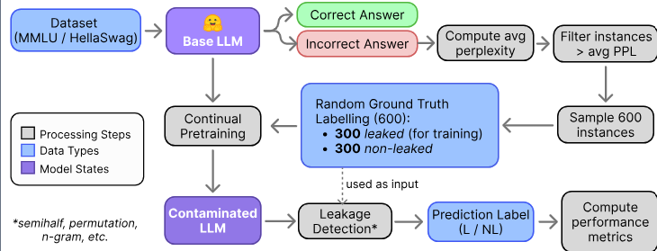

# Simulating Training Data Leakage in Multiple-Choice Benchmarks for LLM Evaluation



## Abstract
The performance of large language models (LLMs) continues to improve, as reflected in rising scores on standard benchmarks. However, the lack of transparency around training data raises concerns about potential overlap with evaluation sets and the fairness of reported results. In this work, we compare existing leakage detection techniques, namely Permutation and N-Gram-based methods, under a continual pretraining setup that simulates real-world leakage scenarios, and additionally explore a lightweight method we call Semi-half question. Although Semi-half offers a low-cost alternative, our analysis shows that the N-gram method consistently achieves the highest F1-Score. We also refine these techniques to support instance-level detection and reduce computational overhead. Leveraging the best-performing method, we create cleaned versions of MMLU and HellaSwag, and re-evaluate several LLMs. Our findings present a practical path toward more reliable and transparent evaluations, and we recommend contamination checks as a standard step before releasing benchmark results.

## How to Run Experiment for a Specific Model and Dataset
```
# Run Full Question and Sample Dataset for Continual Pretraining
./run_full_question.sh Qwen/Qwen2.5-7B mmlu

# Run Continual Pretraining on the Base Model, save it to a new repo in specified HF account
./run_cpt.sh Qwen/Qwen2.5-7B mmlu <username_hugging_face>

# Evaluate with 5 Specified Methods
./run_experiment.sh Qwen/Qwen2.5-7B mmlu <username_hugging_face>
```